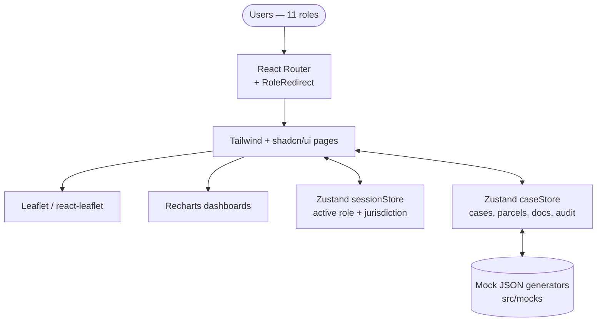
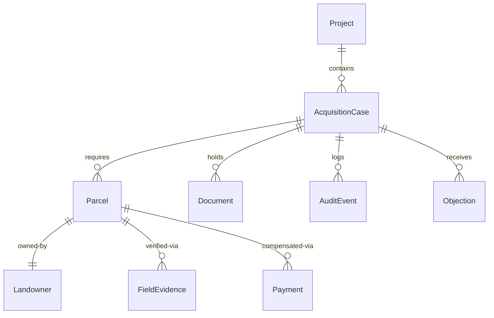

# Terranex — National Land Acquisition Operating System

> A parcel-centric orchestration layer for land acquisition under the RFCTLARR Act, 2013. Built for **Smart India Hackathon 2026 · Problem Statement 26016 · Department of Land Resources (DoLR)**.

Terranex digitizes the complete land-acquisition lifecycle — from project proposal and Social Impact Assessment through Section 11 notification, objections, award, compensation, and possession — into one transparent, auditable, time-bound workflow spanning National → State → District → Tehsil → Village.

**Status:** Frontend-first prototype (MVP). No backend is implemented; all data is realistic mocked state served via Zustand stores. All ULPINs, PFMS IDs, and citizen records are synthetic demonstration data.

---

## Table of Contents

- [Why Terranex](#why-bhoomi-setu)
- [Key Features](#key-features)
- [User Workflow](#user-workflow)
- [Architecture](#architecture)
- [Tech Stack](#tech-stack)
- [Project Structure](#project-structure)
- [Requirements](#requirements)
- [Quick Start](#quick-start)
- [Available Scripts](#available-scripts)
- [Core Modules](#core-modules)
- [Data Model](#data-model)
- [Roles & Access Model](#roles--access-model)
- [Authentication & Authorization](#authentication--authorization)
- [Integrations](#integrations)
- [Limitations](#limitations)
- [Roadmap](#roadmap)
- [Troubleshooting](#troubleshooting)
- [Contributing](#contributing)
- [License](#license)
- [Disclaimer](#disclaimer)

---

## Why Terranex

Land acquisition under the RFCTLARR Act involves 11+ stakeholder roles, statutory SLAs, large document volumes, and coordination across national, state, district, and village levels — today handled through fragmented, paper-heavy processes that cause project delays, grievances, and litigation.

Terranex provides a single source of truth that:

- Gives every role a jurisdiction-scoped workspace (a Collector sees their district; a Field Officer sees their villages).
- Advances each `AcquisitionCase` through a shared, stage-gated pipeline with an immutable audit trail.
- Renders every parcel spatially via GIS overlays so acquisition scope is visible, not just tabular.
- Gives citizens a dedicated portal to track notices, file objections, and follow compensation.

It is a **consumer** of authoritative land records (DILRMP via ULPIN), not a replacement for them, and a **coordinator** of disbursement (via PFMS), not an accounting system.

---

## Key Features

### Core

- **11 role workspaces** — tailored dashboards and action queues for every actor, from National Admin to Citizen (`src/features/*`).
- **Stage-gated case pipeline** — proposal → scrutiny → SIA → Sec-11 notification → objections → Sec-19 declaration → field verification → award → payment → possession (`src/lib`, `src/stores/caseStore.ts`).
- **GIS parcel visualization** — interactive Leaflet / react-leaflet maps with parcel overlays and mock GeoJSON (`src/features/gis`).
- **Citizen portal** — landowners track notices, file objections/grievances, and follow payment status (`src/features/citizen`, `src/features/grievances`).
- **Document vault** — mocked repository for statutory notices, SIA reports, and awards (`src/features/documents`).
- **Audit trail** — every transition and upload logged as an `AuditEvent` (`src/features/audit`, `src/mocks/audit.ts`).
- **Analytics dashboards** — SLA risk, stage funnel, and compensation views built with Recharts (`src/features/analytics`).

### Additional

- Role switcher on the landing page for demo login (no passwords in the MVP).
- Jurisdiction filtering so each role only sees its legal scope.
- shadcn/ui + Radix + Tailwind institutional design system with dark-mode-ready tokens.
- Strict TypeScript domain models (`src/types/domain.ts`, `src/types/rbac.ts`).

---

## User Workflow

```mermaid
flowchart LR
    RO[Requiring Org\nsubmits proposal] --> ST[State / Collector\nscrutiny]
    ST --> SIA[SIA Expert Group\nassessment + hearing]
    SIA --> N11[CALA issues\nSec-11 notice]
    N11 --> OBJ[Citizen files\nobjection]
    OBJ --> HR[Hearing by\nCALA / Tehsil]
    HR --> D19[Sec-19\ndeclaration]
    D19 --> FV[Field Officer\nGPS verification]
    FV --> AW[Finance + CALA\naward]
    AW --> PAY[PFMS\ndisbursement]
    PAY --> POS[Possession\n+ closure]
```



Pick a role on the landing page → you land in that role's workspace → work items are filtered by jurisdiction → actions advance the shared case stage → audit log and dashboards update.

---

## Architecture



**Current reality:** the entire stack is client-side. There is no API server, no database, and no auth service. `sessionStore.ts` holds the demo identity; `caseStore.ts` is the de-facto backend (case transitions, parcel updates, payment statuses, audit appends). A production evolution would insert an API gateway, server-enforced RBAC middleware, and PostgreSQL/PostGIS behind the stores.

| Component | Location | Responsibility |
|---|---|---|
| Router + role redirect | `src/app/router.tsx`, `src/app/RoleRedirect.tsx` | Route table, role-based landing and guards |
| Feature workspaces | `src/features/*` | Per-role dashboards and workflows |
| Domain store | `src/stores/caseStore.ts` | Case lifecycle, parcels, documents, payments, audit |
| Session store | `src/stores/sessionStore.ts` | Active demo role and jurisdiction scope |
| RBAC engine | `src/types/rbac.ts` | `canAccess`, jurisdiction filtering |
| Mock data | `src/mocks/*` | Cases, parcels, projects, officers, audit seed |

---

## Tech Stack

| Layer | Technology | Purpose |
|---|---|---|
| Framework | React 18, TypeScript 5, Vite 5 | SPA shell and rendering |
| Styling / UI | Tailwind CSS 3.4, shadcn/ui, Radix UI | Accessible component system |
| State | Zustand 4 | Client stores simulating the backend |
| Routing | React Router 6 | Client-side routing, role redirects |
| Maps | Leaflet 1.9, react-leaflet 4 | Parcel GIS rendering |
| Charts | Recharts 2.12 | Dashboards and analytics |
| Icons | Lucide React | Iconography |
| Quality | `tsc --noEmit`, Oxlint | Type checking, linting |

No backend, database, cache, queue, or observability stack is present in this MVP.

---

## Project Structure

```text
.
├── src/
│   ├── app/           # router.tsx, RoleRedirect.tsx
│   ├── components/    # shadcn primitives, app shell, shared UI
│   ├── features/      # per-role workspaces: admin, collector-cala,
│   │                  #   tehsil-sdo, field-officer, sia-expert, rr-officer,
│   │                  #   finance-officer, citizen, requiring-org, ministry,
│   │                  #   state-nodal, land-admin + gis, cases, documents,
│   │                  #   audit, analytics, grievances, notifications, overview
│   ├── lib/           # utils, stage definitions
│   ├── mocks/         # cases, parcels, projects, officers, audit seed
│   ├── stores/        # caseStore.ts, sessionStore.ts
│   ├── types/         # domain.ts, rbac.ts
│   ├── App.tsx        # app root
│   └── main.tsx       # entry point
├── index.html
├── tailwind.config.ts
├── vite.config.ts     # dev port 3000, alias @ -> src
├── package.json
└── docs/              # prototype blueprint + reconstruction audit
```

---

## Requirements

- **Node.js >= 18** (declared in `package.json` engines; exact minor not pinned)
- npm (lockfile committed as `package-lock.json`; pnpm/yarn will also work but commands below use npm)
- No database, Docker, or external service required.

---

## Quick Start

```bash
# 1. Clone
git clone <repository-url>
cd Grid   # repo directory as checked out

# 2. Install
npm install

# 3. Start dev server
npm run dev
```

Open **http://localhost:3000** (configured via `vite.config.ts` with `strictPort: true`).

Production build and preview:

```bash
npm run build    # emits dist/
npm run preview  # serves the build on http://localhost:4173
```

To try the workflows: open the landing page, use the role switcher to sign in as any of the 11 roles (e.g. Requiring Org → submit proposal; Collector/CALA → issue Sec-11 notice; Citizen → file objection; Finance Officer → process award), and watch the case stage, audit log, and dashboards update.

---

## Available Scripts

| Command | Source | Description |
|---|---|---|
| `npm run dev` | `package.json` | Start Vite dev server (port 3000) |
| `npm run build` | `package.json` | Production build to `dist/` |
| `npm run preview` | `package.json` | Preview production build (port 4173) |
| `npm run typecheck` | `package.json` | `tsc --noEmit` |
| `npm run lint` | `package.json` | `oxlint` |

No test, format, or seed scripts exist.

---

## Core Modules

- **Role workspaces (`src/features/*`)** — each role gets its own dashboard, queues, and permitted actions; all read through the session + domain stores.
- **Domain store (`src/stores/caseStore.ts`)** — central state machine for `AcquisitionCase`: stage transitions, parcel arrays, `AuditEvent` log, `Payment` statuses.
- **Session store (`src/stores/sessionStore.ts`)** — holds the active demo role and jurisdiction; drives all filtering.
- **RBAC engine (`src/types/rbac.ts`)** — `canAccess(role, stage)` plus jurisdiction filters; enforced client-side only in this MVP.

---

## Data Model

Conceptual model implemented as TypeScript types in `src/types/domain.ts` (no database):



State is seeded from `src/mocks/*` on load and lives in memory for the session; refreshing the browser resets all progress.

---

## Roles & Access Model

Strict National → State → District → Tehsil → Village hierarchy; jurisdiction determines visibility.

| Role | Scope | Responsibility |
|---|---|---|
| National Admin / DoLR | National | Apex oversight, audit, monitoring |
| Ministry Nodal Officer | Ministry | Sponsoring-ministry tracking (e.g. MoRTH, MoD) |
| Requiring Organization | Project | Submits requirements, deposits funds |
| State Nodal Officer | State | Cross-district coordination, SLA monitoring |
| District Collector / CALA | District | Statutory authority: notices, hearings, awards |
| Tehsil / SDO | Tehsil | Scrutiny, verification, local coordination |
| Field Officer / VAO | Village | Measurement, panchnama, GPS evidence |
| SIA Expert Group | District | Social Impact Assessment, public hearings |
| R&R Officer | District | Resettlement entitlements, colony development |
| Finance Officer | District | Compensation computation, disbursement |
| Citizen / Landowner | Own parcels | Tracks notices, files objections, receives payment |

---

## Authentication & Authorization

- **Authentication (mocked):** role switcher on the landing page; no passwords, tokens, or SSO.
- **Authorization (client-side only):** `RoleRedirect.tsx` guards routes; `rbac.ts` filters data by role and jurisdiction.
- **Explicit non-claim:** nothing here is a server security boundary. All state and logic are visible in the browser. Production requires server-enforced auth (e.g. JWT via government SSO such as e-Pramaan — planned, not implemented).

No secrets or environment variables are required to run the prototype (standard Vite defaults only).

---

## Integrations

All external integrations are **planned and simulated in the UI only** — no live API connections exist:

| System | Intended use |
|---|---|
| DILRMP / ULPIN | Fetch authoritative ownership (Khata/Khasra) by parcel ID |
| PFMS | Audited direct-benefit-transfer of compensation |
| PM Gati Shakti | Import geospatial project alignments |
| Bhoomi Rashi | Interop for MoRTH highway acquisitions |

---

## Limitations

- **Volatile state** — refresh resets cases, documents, and progress to mock seed.
- **Fictional data** — all ULPINs, transaction IDs, names, and geographies are synthetic.
- **Client-side RBAC** — bypassable by design in an MVP; not a security boundary.
- **Scale** — client-side filtering will degrade with thousands of parcels; no pagination/virtualization guarantees.
- **No backend, tests, CI, Docker, or observability** — static analysis only (`typecheck`, `lint`).

---

## Roadmap

### Implemented

- RBAC routing and jurisdiction filtering for all 11 roles
- Per-role responsive workspaces and dashboards
- Leaflet GIS parcel overlays (mock GeoJSON)
- Mock document vault, audit log, grievance/objection flows

### In Progress / Planned

- **Backend + database** — API layer with PostgreSQL/PostGIS replacing Zustand mocks
- **Real auth** — JWT via government SSO
- **Live DILRMP/ULPIN and PFMS integrations**
- **Testing** — unit (Vitest) and E2E (Playwright) suites
- **Multi-tenant national rollout** supporting per-state rulesets

Roadmap items are aspirations; only the Implemented list above is verified in code.

---

## Troubleshooting

**`npm run dev` says the port is in use.**
The dev server uses `strictPort: true` on port 3000 — it will not auto-pick another port. Stop the process on :3000 or free the port, then retry.

**Page is blank / map tiles missing.**
Check the dev-server console for module errors, and confirm outbound network access for Leaflet tile layers (map tiles load from a third-party tile CDN).

**State reset after refresh.**
Expected: the MVP is in-memory only with no persistence layer.

**`@/...` import errors in an editor.**
The `@` alias maps to `./src` in both `vite.config.ts` and `tsconfig.json` — ensure your editor uses the workspace TypeScript version.

---

## Contributing

This is an SIH 2026 competition prototype; external contributions are not currently being accepted. If that changes, the expected flow is: fork → branch → `npm install` → change → `npm run typecheck` + `npm run lint` → pull request.

---

## License

No open-source license is currently specified in the repository. All rights reserved by default — contact the maintainers before reuse.

---

## Disclaimer

Prototype / proof of concept for Smart India Hackathon 2026. Frontend-only simulation: data, workflows, and integrations are mocked and do not interact with real government databases. See `docs/PROTOTYPE_BLUEPRINT.md` and `docs/PROTOTYPE_RECONSTRUCTION_AUDIT.md` for design background.
